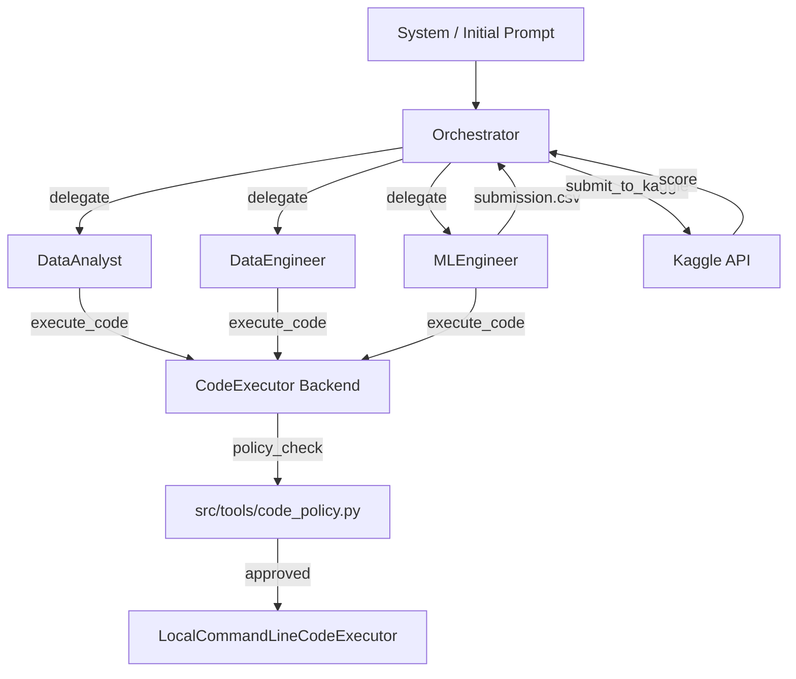

# DOC

## Architecture

The project implements a multi-agent AutoGen pipeline for Kaggle competitions.

- LLM access is routed through OpenRouter.
- Different agents can use different LLM models (configured in `.env`).
- Code execution is separated from reasoning and passed through policy checks.
- Kaggle submission is executed by a Python wrapper outside agents.

## Repository layout

- `data/raw/` - input datasets (read-only for agents).
- `workspace/run_XXX_timestamp/` - generated run workspace for one launch.
- `src/agents/` - agent prompts, config loading, factory.
- `src/tools/` - deterministic safety checks, trajectory logger, Kaggle submitter.
- `src/chat_manager.py` - group chat and speaker routing.
- `src/main_loop.py` - top-level orchestration loop.
- `logs/` - persisted trajectory events in JSON.

## Architecture Diagram

## Agent roles

1. `Orchestrator`
   Coordinates process and decisions, does not write code.

2. `CodeExecutor`
   Executes Python code only with `llm_config=False` and local executor in current run dir.

3. `DataAnalyst`
   Produces textual EDA/hypotheses only (no plotting libraries or `.plot()`).

4. `DataEngineer`
   Implements preprocessing/features, writes `X_train.csv`, `y_train.csv`, `X_test.csv`.

5. `MLEngineer`
   Trains/evaluates model, reports MSE, creates `submission.csv`.

## OpenRouter and model routing

Required environment variables:

- `OPENROUTER_API_KEY`
- `OPENROUTER_BASE_URL`
- `OPENROUTER_MODEL_ORCHESTRATOR`
- `OPENROUTER_MODEL_DATA_ANALYST`
- `OPENROUTER_MODEL_DATA_ENGINEER`
- `OPENROUTER_MODEL_ML_ENGINEER`

Each role receives its own model through `llm_config_for_role(...)`.

## Safety and code policy

Deterministic checks are implemented in `src/tools/code_policy.py` and enforced before code execution.

Blocked classes:
- package installation attempts
- network usage
- plotting libraries and `.plot()`
- obvious path traversal / absolute-path writes
- imports outside allowed ML stack (with small standard-library exceptions)

If policy check fails, execution is rejected and error is returned back into chat flow.

## Code execution algorithm

Code execution is handled directly by the agents:

1. Code proposals from `DataAnalyst`, `DataEngineer`, or `MLEngineer` are sent to `CodeExecutor`.
2. `CodeExecutor` runs the code with policy checks and returns results.
3. Results are returned to the author agent for further processing or debugging.
4. Agents can iteratively debug and fix their code within an isolated execution loop.

## RAG (Retrieval-Augmented Generation)

The RAG system is implemented in `src/tools/rag.py`. It provides agents with context from the `best_trajectories/` directory.

- **Extraction**: It parses JSON logs to find `agent_completed_task` events and `kaggle_submission` scores.
- **Injection**: Captured knowledge is appended to the initial system prompt, helping agents replicate successful feature engineering and modeling patterns.

## Benchmarking

Performance metrics are persisted in `logs/benchmark.jsonl` upon completion of each run. Each entry contains:
- `ts`: Execution timestamp.
- `run`: Run directory name.
- `best_score`: Final metric achieved.
- `rounds`: Total rounds consumed.
- `stop_reason`: Termination trigger (target met, limit reached, or interrupted).

## Main loop workflow

1. **Initialization**: Load environment and validate system configuration.
2. **Environment Setup**: Create timestamped run directory and initialize logging.
3. **RAG Context**: Query `best_trajectories/` and build the augmented initial prompt.
4. **Agent Loop**:
   - `Orchestrator` analyzes state and delegates to a specific agent.
   - Target agent (Analyst, Engineer, or MLE) performs work and executes code via the backend.
   - Chat trajectory is persisted in real-time.
5. **Kaggle Integration**: Submits results to the competition API and retrieves live leaderboard scores.
6. **Persistence**: Flushes final trajectory and appends summary to the benchmark file.

## Logging

`TrajectoryLogger` stores timestamped events in `logs/<run>.json`.
Saved events include:
- `orchestrator_turn`: Decisions and directives.
- `agent_reply`: Tool calls and reasoning from specialized agents.
- `kaggle_submission`: Detailed submission results and scores.
- `stop_condition_met`: Successful completion events.
